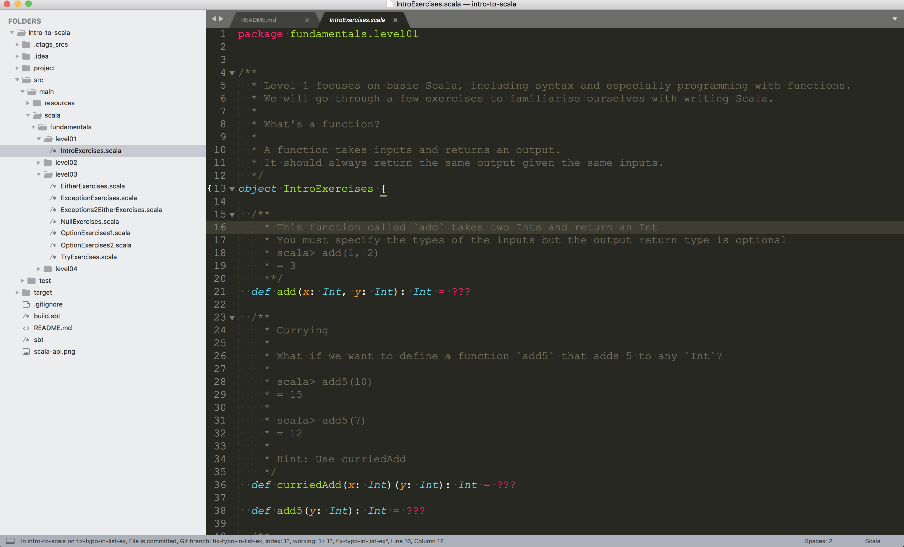
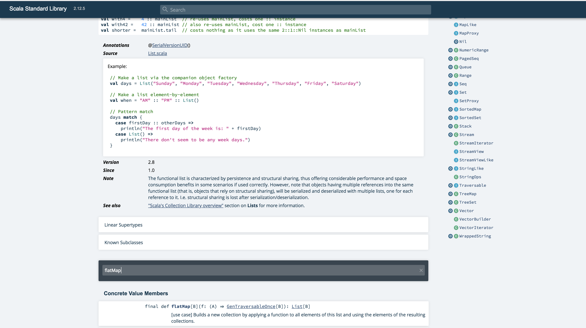

# intro-to-scala

Two day Scala fundamentals course.

This course is meant to be run in person. There are comments in the exercises to try and point you in the right direction so you should be able to do this in your spare time if you desire. Unit tests are included to verify your solutions for each exercise.

Use `sbt test` to run the tests. The first time you run the tests, they will all fail. This is a good thing! As you complete each exercise correctly, the tests will pass.

We welcome pull requests and feedback!

## Schedule

### Day 1

* 9.30 - Start
* 10 - Intro to FP/Scala (__presentation__)
* 10.30 - [IntroExercises](src/main/scala/fundamentals/level01/IntroExercises.scala)
* 11 - Break
* 11.15 - Intro to ADTs (__presentation__)
* 11.30 - [TypesExercises](src/main/scala/fundamentals/level02/TypesExercises.scala)
* 12.15 - Lunch
* 1:30 - [ListExercises](src/main/scala/fundamentals/level02/ListExercises.scala)
* 3 - Break
* 3.15 - [NullExercises](src/main/scala/fundamentals/level03/NullExercises.scala) (skip if familiar with downside of nulls)
* 3.45 - [OptionExercises pt. 1 (Safe constructors)](src/main/scala/fundamentals/level03/OptionExercises1.scala)
* 4:45 - End

### Day 2

* 9.30 - Intro to Error Handling (__presentation__)
* 10.15 - [OptionExercises pt. 2](src/main/scala/fundamentals/level03/OptionExercises2.scala)
* 11.15 - Break
* 11.30 - [ExceptionExercises](src/main/scala/fundamentals/level03/ExceptionExercises.scala) (skip if familiar with downside of exceptions)
* 12.30 - Lunch
* 1.30 - [Exceptions2EitherExercises](src/main/scala/fundamentals/level03/Exceptions2EitherExercises.scala) / [EitherExercises (Optional)](src/main/scala/fundamentals/level03/EitherExercises.scala)
* 2 - Break
* 2.15 - [TryExercises](src/main/scala/fundamentals/level03/TryExercises.scala)
* 3.15 - [LogParser](src/main/scala/fundamentals/level04/LogParser.scala)
* 4.15 - End

## Pre-requisites

**Fork or clone this repository**

```
git clone https://github.com/wjlow/intro-to-scala.git
cd intro-to-scala/
```

**Install Java 8 (do not install Java 9 or Java 10)**

```
brew tap caskroom/versions
brew cask install java8
```

**Install sbt 1.x (recommended but optional, we have included a portable version)**

We recommend that you install `sbt` on your machine even though a portable runner is included.

> The actual version of `sbt` used is in your `project/build.properties` file and the global `sbt` is merely used for bootstrapping your project. You should not get conflicting `sbt` installations even if you have multiple Scala projects using different versions of `sbt`.

```
brew install sbt@1
```

__Tip__: Launching SBT might take some time, so we recommend using SBT's interactive shell to run commands, instead of lauching SBT for each command.

To run the `sbt` shell from the global installation use:

```
sbt
```

To run the `sbt` shell from the portable installation use:

```
./sbt
```

**Compile program to resolve dependencies before the course**

Launch the SBT shell.

To only compile production code use:

```
~compile
```

To compile production and test code use:

```
~test:compile
```

## How to run tests

### To run all tests

To run all tests use:

```
test
```

The first time you run all the tests you will get a lot of errors! These tests will be fixed by you during the duration of the course.

### Running a single test file

In the meantime, run only a single test case at a time to keep things manageable.

To run a single test use:

```
~testOnly package.path.of.test.TestName
```


For example to run only the _fundamentals.level01.IntroExercisesTest_ test case use:

```
~testOnly fundamentals.level01.IntroExercisesTest
```

To run by test case name only use:

```
~testOnly *TestName
```

For example to run the _fundamentals.level01.IntroExercisesTest_ test case use:

```
~testOnly *IntroExercisesTest
```


The `~` watches for changes to your files and runs the command automatically. It's nice to use it to get really fast feedback as you are working on the exercises!

To stop watching changes through `~`, use the __enter__ key to return to the SBT shell prompt.

To exit the SBT shell use:

```
exit
```

[SBT 1.x documentation](https://www.scala-sbt.org/1.x/docs/index.html)

## IDE setup (please set this up before the course)

<details><summary>IntelliJ IDEA</summary>


<p>

1. [Download IntelliJ (free Community edition is fine)](https://www.jetbrains.com/idea/download/#section=mac)

2. Install and open IntelliJ

3. If running IntelliJ for the very first time, it might ask you what plugin you want to install. Select _Scala_, otherwise install manually: _Configure -> Plugins -> Browse Repositories -> Scala_

4. Restart IntelliJ to activate the plugin

5. Open IntelliJ and open this project: _Open -> Select directory where project is in_

6. Wait for IntelliJ to download dependencies (this might take a while)

7. Compile project with Command+F9

8. You can run individual tests by right-clicking and then selecting _Run ...ExercisesTest_

Tips:

* Use Command+P inside the argument of a function to see what type the argument needs to be.

* Use Control+Shift+P to find out the type of a highlighted expression. 

</p></details>

<details><summary>Text Editor (Vim/Sublime/Atom/Emacs)</summary>



<p>

1. Open the current directory in an editor of your choice.

2. Open the SBT shell in a terminal window.

3. Compiling - See SBT instructions on how to compile code.

4. Running Tests - See SBT instructions on how to run tests.

5. Looking up Scala API - You can also search through the [Scala APIs](https://www.scala-lang.org/api/current/) to find any necessary methods.


 
</p></details>
